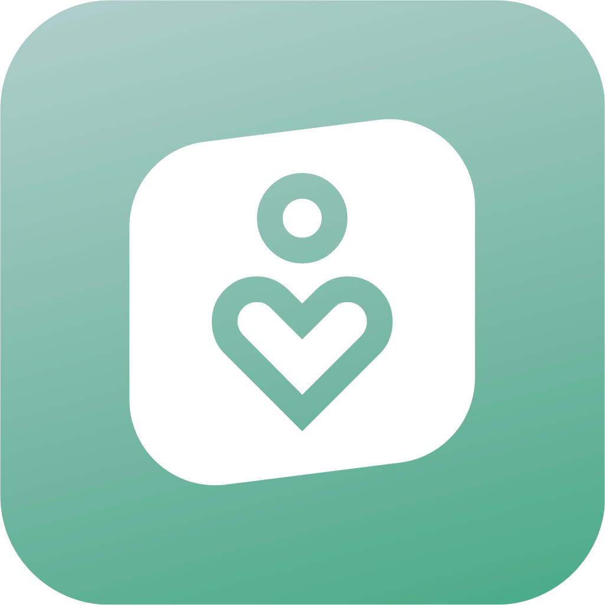

# Activ8

Your Personal Health Activisor

## Motivation

Many students at UCI are living on their own for the first time. Many feel intimidated and struggle to keep up with taking care of themselves. In contrast, others simply neglect regular physical activity, a well-balanced diet they enjoy, and a consistent quality sleep schedule. Focusing on these things helps students effectively study for their exams and eventually build a career and family. A better quality of life has been shown to improve mental and physical well-being.

## Feature Overview

Activ8 is a recommendation system that:

- Asks you to log your meals
- Tracks your step data
- Monitors your sleep habits

Using this information, Activ8:

- Provides recommendations on things to eat that you'd likely enjoy
- Gives you daily weather-sensitive advice on how to reach your step goal
- Suggests a healthy sleeping schedule around your circadian rhythm and busy schedule

## Screenshots

 

## Runbooks

This project has a frontend and backend component. If you wish to build this app for yourself, please check out the runbooks for both sections:

- [App Runbook](app/README.md)
- [Server Runbook](server/README.md)

We also provide the definitions of the API, which acts as the interface between the app and server:

- [API Reference](API.md)

## Design & Implementation

If you'd like to see more details about implementation and exactly what Activ8 does, please check out the project overview for more details:

- [Project Overview](PROJECT.md)
